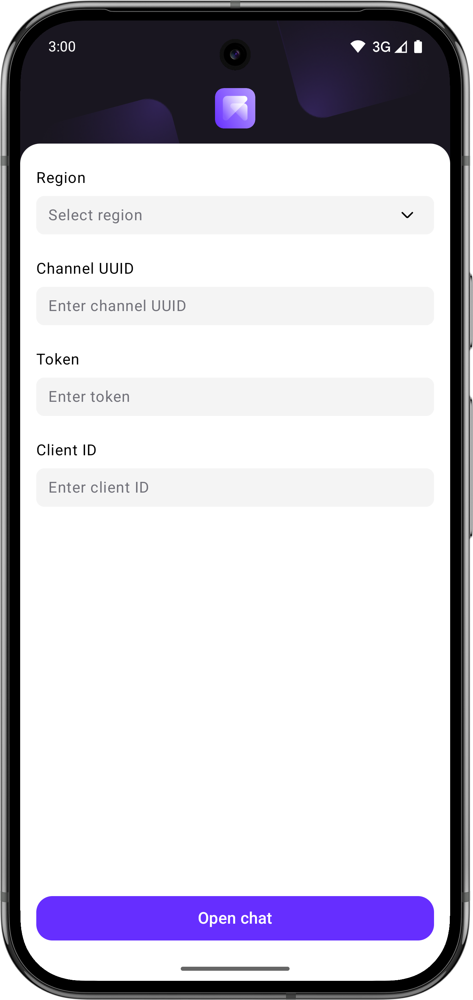
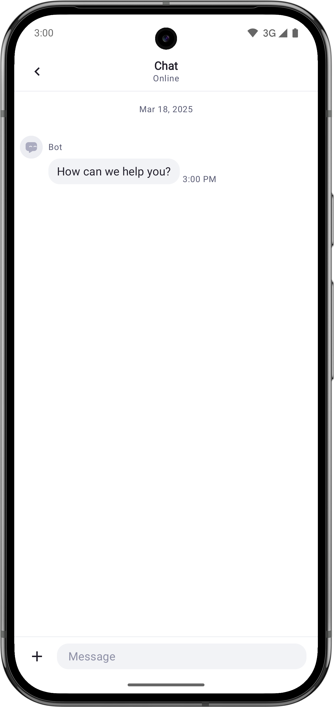

# Voximplant Kit Chat Android Demo

This demo app demonstrates the Voximplant Android Kit Chat UI SDK that allows you to add in-app messaging
into your Android application with a ready-to-go user experience.

## Getting started

To get started, you need to [register](https://kit.voximplant.com/registration?lang=) a Voximplant Kit account
and [create](https://voximplant.com/kit/docs/setup/conversations/channels/mobilechat) a mobile chat channel.

## Build and install

1. Clone this repository.
2. Open the repository in Android Studio.
3. Wait for `gradle sync` to complete and build for the target device.

## Usage

 

Enter your mobile chat channel details (region, channel UUID, token) and a client Id.

> [!IMPORTANT]
> Client Id is a random string that should match the regexp pattern `[a-zA-Z0-9@#$_\-+\.]`.

## Push notifications

Push notifications require additional setup.

1. Create a new Firebase project in your Firebase account.
2. Register your application with the `com.voximplant.demos.kitchat` namespace.
3. Generate a `google-services.json` file and replace the [file](./app/google-services.json) in the project.
4. Create a service account key in json format and [upload](https://voximplant.com/kit/docs/setup/conversations/pushcertificates#uploading-push-certificates-to-voximplant-kit) it to Voximplant Kit.
5. Select the uploaded certificate in the mobile chat channel.